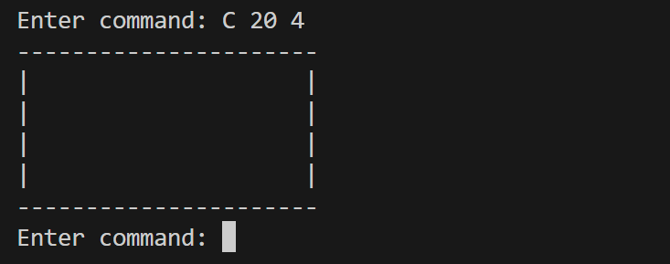
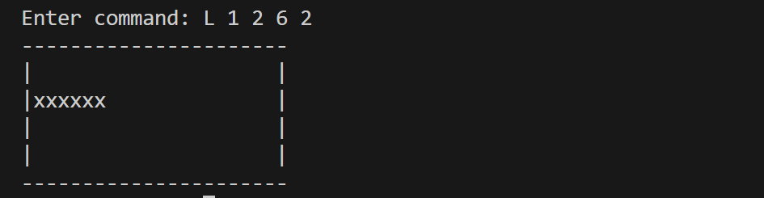
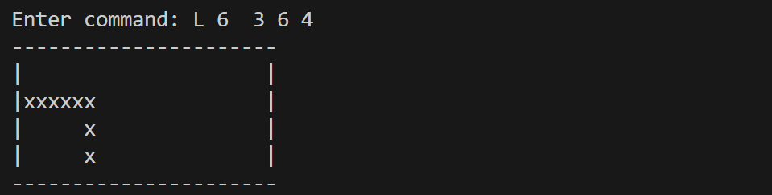
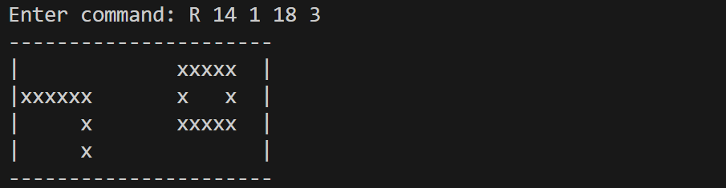
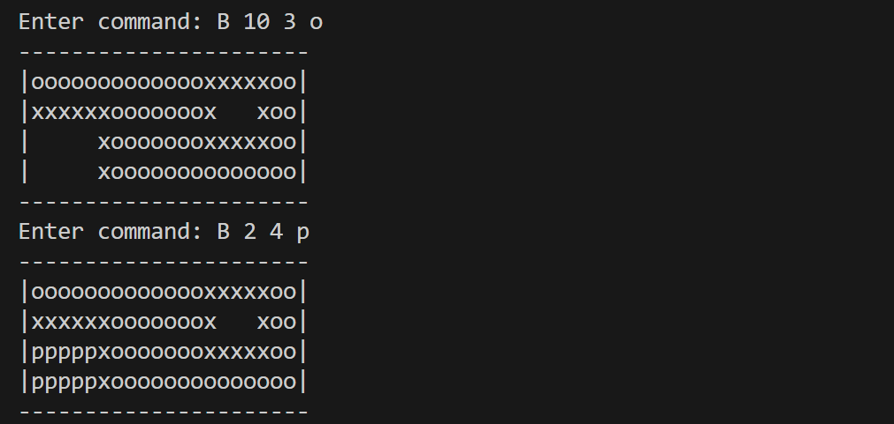
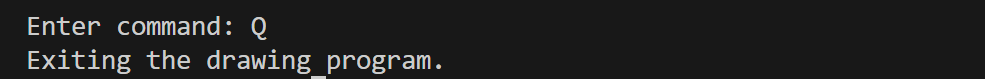

# A simple drawing tool

## 1. Introduction
This project is designed to demonstrate basic graphics concepts using Python, while also showcasing techniques such as object-oriented programming and recursion. It includes features such as:
- **Create a Canvas**: Generate a blank canvas by specifying width and height.
- **Draw a line**: Only support horizontal and vertical lines by giving two pairs of coordinates.
- **Draw a rectangle**: By specifying two corners.
- **Bucket fill**: Fill an area that connected to a given point (x,y) with a specified color.
- **Interactive Commands**: Provide commands in a user-friendly manner to draw and manipulate the canvas.

## 2. Installation
Follow the steps below to set up the project on your local machine:
### 2.1. Prerequisites
Before installing, make sure you have the following installed on your system:
- **Python 3.6+**: You can download it from [python.org](https://www.python.org/downloads/).
- **Git** (optional): To clone the repository. You can download it from [git-scm.com](https://git-scm.com/).
---
### 2.2. Clone the Repository
1. Open a terminal or command prompt.
2. Run the following command to clone the project repository:
   ```bash
   cd <your-target-directory>
   git clone https://github.com/EstherWU2024/Canvas.git
   cd Canvas
   ./install.sh <your-config-path>
    ```
   Replace <your-target-directory> with the folder where you want to clone the repository.<br>
   Replace <your-config-path> with the path where you want the script to perform the installation (e.g., /config or another target directory).

## 3. Code Structure

The program is organized into the following components:

### **3.1. `Canvas` Class**
The `Canvas` class encapsulates all the operations related to drawing and manipulating the canvas. It contains methods to create, display, and modify the canvas.

- **Attributes:**
  - `w`: Width of the canvas.
  - `h`: Height of the canvas.
  - `canvas`: A 2D list representing the drawing area.

- **Methods:**
  - `__init__(self, w, h)`: Initializes a blank canvas of width `w` and height `h`.
  - `show(self)`: Displays the current state of the canvas in the terminal.
  - `check(self, x1, y1, x2, y2)`: Validates that the given coordinates are within the canvas boundaries and correctly ordered.
  - `line(self, x1, y1, x2, y2, is_show)`: Draws a horizontal or vertical line on the canvas.
  - `rectangle(self, x1, y1, x2, y2)`: Draws a rectangle by combining four lines.
  - `fill(self, x, y, c)`: Implements the bucket-fill operation using a recursive flood-fill algorithm.
---

### **3.2. `main` Function**
The `main` function provides the entry point for the program. It sets up the command-line interface and handles user inputs.

- **Key Responsibilities:**
  - Displays instructions and command syntax to the user.
  - Processes user commands and delegates them to the appropriate methods in the `Canvas` class.
  - Handles input validation and errors gracefully.

- **Available Commands:**
  - `C w h`: Creates a new canvas of width `w` and height `h`.
  - `L x1 y1 x2 y2`: Draws a line from `(x1, y1)` to `(x2, y2)` (only horizontal or vertical lines are supported).
  - `R x1 y1 x2 y2`: Draws a rectangle with the upper-left corner at `(x1, y1)` and bottom-right corner at `(x2, y2)`.
  - `B x y c`: Fills the area connected to `(x, y)` with the character `c`.
  - `Q`: Exits the program.
---

### **3.3. Command Handlers**
The program uses a dictionary to map command types to specific handler functions:
- `create_canvas`: Initializes a new canvas.
- `draw_line`: Draws a line on the canvas.
- `draw_rectangle`: Draws a rectangle on the canvas.
- `bucket_fill`: Fills a region on the canvas with a specified character.
- `quit_program`: Exits the application.

Each handler function validates the input, performs the requested operation, and handles any errors.

---

### **3.4. Recursive Flood-Fill Algorithm**
The `fill(self, x, y, c)` method uses recursion to implement the bucket-fill feature:
- It starts from a given point `(x, y)`.
- It recursively fills all connected blank spaces with the specified character `c`.
- The algorithm stops when it encounters the canvas boundary or a previously filled region.


## 4. Available Commands

The program supports the following commands:

| Command         | Description                                                                                  | Example                     |
|-----------------|----------------------------------------------------------------------------------------------|-----------------------------|
| `C w h`         | Create a new canvas of width `w` and height `h`.                                             | `C 20 4`                   |
| `L x1 y1 x2 y2` | Draw a line from `(x1, y1)` to `(x2, y2)`. Only horizontal or vertical lines are supported.   | `L 1 2 6 2`                |
| `R x1 y1 x2 y2` | Draw a rectangle with the upper-left corner at `(x1, y1)` and bottom-right corner at `(x2, y2)`. | `R 14 1 18 3`           |
| `B x y c`       | Fill the area connected to `(x, y)` with the character `c`.                                  | `B 10 3 o`                 |
| `Q`             | Quit the program.                                                                            | `Q`                         |

---

## 5. Example Usage

Below are some examples demonstrating how to use the program:

### Example 1: Creating a Canvas
Command: C 20 4 <br>
Output:<br>


### Example 2: Drawing a Line
Command: L 1 2 6 2 <br>
Output:<br>


### Example 3: Drawing a vertical line
Command: L 6 3 6 4 <br>
Output:<br>


### Example 4: Drawing a Rectangle
Command: R 14 1 18 3 <br>
Output:<br>


### Example 5: Bucket Fill
Command: B 10 3 o | B 2 4 p <br>
Output: <br>


### Example 6: Quit program
Command: Q <br>
Output: <br>


## 6. Input Validation and Error Messages

The program includes robust input validation to ensure that all commands and parameters are entered correctly. If an error occurs, the program will print an appropriate error message. Below are the common checks performed and their corresponding error messages:

### 1. General Input Errors
- **Invalid Command**: If a user enters an unrecognized command, the program will display:<br>
Undefined command type. Please use C, L, R, B, or Q.
- **Coordinates Out of Bounds**: If any part of the pattern is outside the canvas boundaries, the program will display: <br>
Error: Coordinates are out of canvas bounds.

### 2. Canvas Creation (`C w h`)
- **Missing or Invalid Parameters**: If the width (`w`) or height (`h`) is not provided or is not a positive integer, the program will display: <br>
Please enter positive integers for width and height.

### 3. Drawing a Line (`L x1 y1 x2 y2`)
- **Missing or Invalid Parameters**: If the coordinates (`x1`, `y1`, `x2`, `y2`) are not provided or out of range or invalid, the program will display: <br>
Invalid parameters, please use: L x1 y1 x2 y2.
- **Program limitation**: If the line is neighter vertical line nor horizontal line, the program will display:
Error: Only horizontal or vertical lines are supported.

### 4. Drawing a Rectangle (`R x1 y1 x2 y2`)
- **Missing or Invalid Parameters**: If the rectangle coordinates are not provided or out of range or invalid, the program will display: <br>
Invalid parameters, please use: R x1 y1 x2 y2.

### 5. Bucket Fill (`B x y c`)
- **Missing or Invalid Parameters**: If the coordinates (`x`, `y`) are not provided or are not integers, or if the fill character (`c`) is missing, the program will display: <br>
Invalid parameters, please use: B x y c.

### 6. General Usage Errors
- **Canvas Not Created**: If the user attempts to draw a line, rectangle, or perform a fill operation without first creating a canvas, the program will display:
Error: No canvas found. Create a canvas first.

---

### Example Error Scenarios

#### Scenario 1: Invalid Command
Input:
X 10 10

Output:
Undefined command type. Please use C, L, R, B, or Q.


#### Scenario 2: Line Coordinates Out of Bounds
Input:
L 1 1 50 1

Output:
Error: Coordinates are out of canvas bounds.


#### Scenario 3: Fill with Missing Character
Input:
B 5 5

Output:
Invalid parameters, please use: B x y c.


